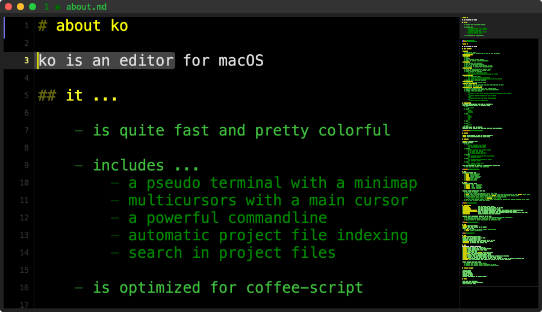

# about ko

ko is an editor for Mac OS X
    
## main features

- **fast**
    - loads large files
- **minimap**
    - shows cursors and selections
    - also for terminal/search-result
    - can be used to select large portions of text
    - sets cursor by default when dragging/clicking
- **terminal**
    - shell commands as ascii headers
    - output of commands editable/searchable
- **file search**
    - search for strings/regexp in project files
    - automatic determination of project files
    - search results are editable
        - edits can be saved back to files
        - more powerful than conventional search and replace
- **multicursors**
    - not all cursors are equal
        - main cursor is always distuingishable
        - main cursor can be moved independently from other cursors
    - powerful set of keyboard shortcuts
- **autocomplete**
    - completes words from visited files
    - completes function/method names from required files
    - optimized for coffee-script
- **syntax highlighting**
    - for coffee, cpp, h, html, js, json, md, noon, pug, py, sh, styl       
    - ansi-colors in terminal view

### minimap

- ⌘ while dragging to turn of cursor placement
- ⇧ shift while dragging/clicking to select lines

### terminal

- ⌘-T to activate input
- ! only for commands that terminate for now !

### find
- search in current file
    - ⌘-F         case insensitive
    - ctrl-F      case sensitive
    - alt-F       regexp insensitive
    - ctrl-alt-F  regexp sensitive
    - ⌘-alt-F     fuzzy search
    - ⌘-ctrl-F    glob search
     
### search
- search in project files
    - ⌘-shift-F          case   insensitive
    - ctrl-shift-F       case   sensitive
    - alt-shift-F        regexp insensitive
    - alt-ctrl-shift-F   regexp sensitive
- editing search result lines will ...
    - mark them for saving
    - changes are propagated immediately to all open files
    - ⌘-S while the search-results view has focus will save all pending changes in open **and** closed files
    - deleting lines from the search results will **not** remove them from their original files
    - changes from the editor are not yet propagated to old search results
        - this means: only edit and save **fresh** search results
    - this is a very powerful feature but not tested thoroughly and probably not working correctly in all cases!
    - use at your own risk! backup your files! 

### multicursors
- ⌘-click                     add or remove single cursor
- ⌘-up|down                   grow all vertical cursor lines up or down
- ctrl-shift-up|down          grow only main cursor line up or down
- ctrl-up|down|left|right     move main cursor independently (clears other cursors when moving over them)
- ctrl-alt-up|down|left|right align all cursors vertically with left|up|down|right-most cursor
- ctrl-shift-right            align all cursors vertically with right-most cursor while moving text to the right
- ⌘-delete                    delete backwards over line boundaries
- cursors can be positioned after the end of line
    - cursors after the end of line have two representations: blue and orange/yellow
    - the orange/yellow position shows where text will be inserted
    - missing spaces are added automatically in multicursor mode

### missing stuff

- no plugin system
- no git integration
- no bracket matching
- no customization

#### notes 

- completely undocumented
- pre-release in active development
- use at your own risk!
