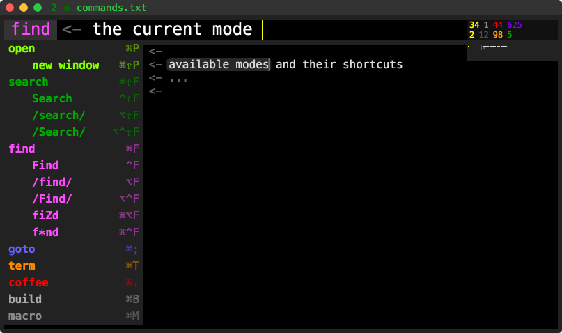
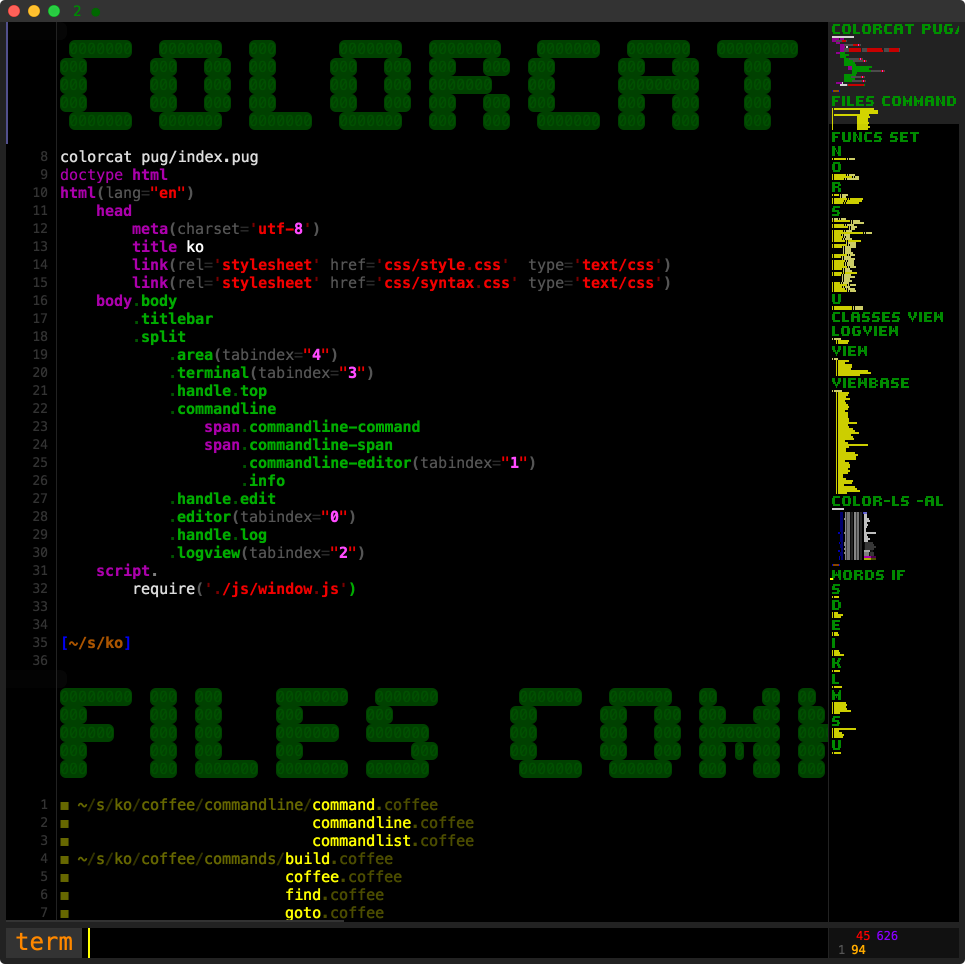
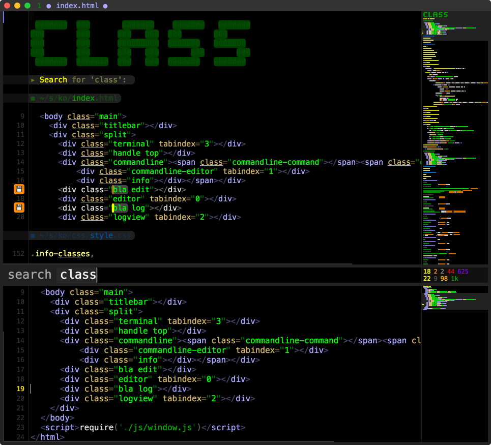
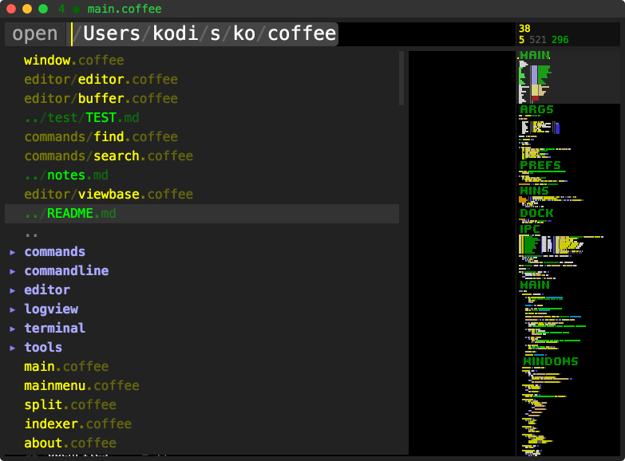

# about ko

ko is an editor for macOS
    
## main features

**fast**
- loads large files
- keyboard centric 
    - nothing you can do with the mouse only
    - includes lots of fancy shortcuts

**commandline**
- a single, non-intrusive input field to ...
    - open files quickly
    - find in text and search in files
    - input terminal and macro commands
    - goto lines or class/method/function-definitions

**terminal**
- alias
- history
- echos commands as ascii-headers
- output of commands editable/searchable

**file search**
- search for strings/regexp in project files
- automatic determination of project files
- search results are editable
    - edits can be saved back to files
    - more powerful than conventional search and replace

**multicursors**
- not all cursors are equal:
    - main cursor is always distuingishable
    - main cursor can be moved independently from other cursors
- powerful set of keyboard shortcuts for modification of cursors

**minimap**
- shows cursors, highlights and selections
- also for terminal/search-result!
- can be used to select large portions of text
- sets cursor by default when dragging/clicking

**autocomplete**
- completes words from visited files and project files
- automatic determination of project files:
    - indexes files below directory containing .git or package.json
    - ignores node_modules, .git, etc.
    
**syntax highlighting**
- for coffee, cpp, h, html, js, json, md, noon, pug, py, sh, styl       
- ansi-colors in terminal view

**optimized for coffee-script**
- completes function/method names from required files
- terminal commands to list classes and functions/methods
- includes a few nifty macros:
    - **dbg** insert log line which outputs class.method + variables under cursors
    - **req** insert require statement for word at cursor
    - **class** creates a new file with simple class skeleton
    - **inv** toggle display of line-breaks

## command-line
- operates in different modes:
    - **open** new window
    - **search** Search /search/ /Search/
    - **find** Find /find/ /Find/ fiZd f*nd
    - **term** Term
    - **goto** selecto
    - **macro**
- each mode keeps it's own history
- clicking on the command name lists all modes and their shortcuts:
    

## terminal

- **⌘T** to activate input

special commands
- **alias**
    - without argument: list aliases
    - with one argument: clear alias
    - with two arguments: set alias
- **history**
    - without argument: list command history
    - !! to repeat last command
    - !n to repeat command with id n
    - !~n to remove command with id n
- **classes**
    - list coffee-script classes and their methods
    - with argument: filter
- **funcs**
    - list coffee-script functions and methods
    - with argument: filter
- **files**
    - list indexed project files
    - with argument: filter
    
all other commands are passed to a child process running bash
- only works for commands that terminate!

## find
search in current file
- **⌘F**  case insensitive
- **^F**  case sensitive
- **⌥F**  regexp insensitive
- **^⌥F** regexp sensitive
- **⌘⌥F** fuzzy search
- **⌘^F** glob search
     
## search
search in project files
- **⌘⇧F**   case   insensitive
- **^⇧F**   case   sensitive
- **⌥⇧F**   regexp insensitive
- **^⌥⇧F**  regexp sensitive
    
editing search result lines will ...
- mark them for saving
- changes are propagated immediately to all open files
- **⌘S** (while the search-results view has focus) will save all pending changes in open **and** closed files
- deleting lines from the search results will **not** remove them from their original files
- changes from the editor are not yet propagated to old search results
    - this means: only edit and save **fresh** search results
- this is a very powerful feature but not tested thoroughly and probably not working correctly in all cases!
- use at your own risk! backup your files! 

## multicursors
- **⌘click**               add or remove single cursor
- **⌘up|down**             grow all vertical cursor lines up or down
- **^⇧up|down**            grow only main cursor line up or down
- **^up|down|left|right**  move main cursor independently (clears other cursors when moving over them)
- **^⌥up|down|left|right** align all cursors vertically with up|down|left|right-most cursor
- **^⇧right**              align all cursors vertically with right-most cursor while moving text to the right
- **⌘delete**              delete backwards over line boundaries

cursors can be positioned after the end of line
- cursors after the end of line have two representations: blue and orange/yellow
- the orange/yellow position shows where text will be inserted
- missing spaces are added automatically in multicursor mode

## open
- **⌘P** open file quickly
- **⌘⇧P** open file quickly in new window

while list is open:
- **.** list current directory without previous files
- **..** navigate directory up

## goto
- **⌘;** activates goto command
- **text** jump to function, class or file
- **positive number** jump to line
- **negative number** jump to line relative to end of file

in editor:
- **⌥enter** goto word under main cursor
- **⌥click** goto clicked word

## minimap

- **⌘** while dragging to turn off cursor placement
- **⇧** while dragging/clicking to select lines

## misc
non-standard keyboard shortcuts:
- **F2** global shortcut to activate ko
- **⌘A** switch between tiled and stacked windows
- **⌘⇧N** clone current file in new window
- **⌥`** open window list
- **⌘L** select more lines **⌘⇧L** select less lines
- **⌥up|down** move selected|cursor lines up|down
- **⌥/** toggle comment on selected|cursor lines
- **⌘I** inverted line selection: select lines without a cursor or a selection
- **⌘⌥Q** close all windows (won't restore on next start) and quit
- **⌘return** evaluate current buffer with coffee in main process and print the result in terminal view
- **⌘⌥up** jump to counterpart file (coffee <-> js, cpp <-> h, pug <-> html, etc)

while command input has focus:
- **^up|down** move command input up|down
- **⌘up|down** move command input to top|bottom of window
- **⌥up|down** move command input a quarter of window up|down

## missing features

- plugin system
- customization
- git integration
- bracket matching
- regression tests
- correct highlighting of complex strings

## notes 

- not very well documented
- pre-release in active development
- use at your own risk!
